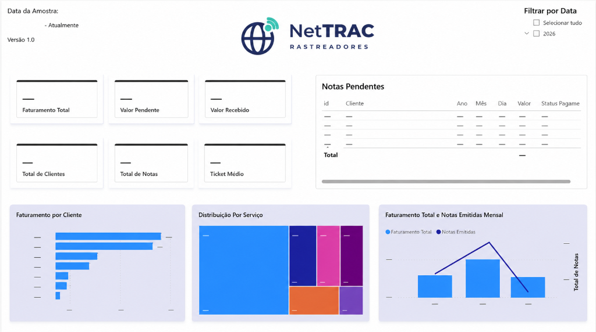

# Pipeline de Notas Fiscais (NFS-e) — NetTRAC

> **Versão:** 1.2.0  
> **Última Atualização:** 05 de Setembro de 2026

---

## O problema

A NetTRAC é especializada em rastreadores veiculares de médio e grande porte. Como qualquer contribuinte no Portal Nacional da NFS-e (nfse.gov.br), a empresa esbarra numa limitação do próprio portal: não existe relatório consolidado nem exportação em lote das notas emitidas. Cada nota só dá pra consultar uma por uma, o que torna inviável qualquer análise de faturamento por cliente, por período ou por tipo de serviço direto pelo site.

Tive acesso autorizado às notas fiscais da empresa e parti daí pra construir uma solução.

## A solução

O projeto prioriza os XMLs das notas por serem documentos estruturados, mas também suporta integralmente os DANFSe em PDF. O parser de PDF extrai os mesmos campos do XML e converte ambos para o mesmo modelo de dados. Isso permite trabalhar com notas quando só o PDF está disponível. Os dados são então organizados em duas tabelas num banco Postgres (Supabase): uma de clientes (`tomadores`) e uma de notas (`notas`), relacionadas entre si. Isso resolve o problema de origem: dá pra consultar faturamento por cliente, sazonalidade, ISS apurado, tudo isso sem depender do portal.

```
Portal nfse.gov.br  →  XML/PDF  →  Parser Python  →  Postgres (Supabase)  →  Power BI Service (Gateway)
```

Um detalhe de modelagem que importou: a chave de deduplicação é a `chave_acesso` da nota (identificador único nacional), não o número dela. Isso torna a importação idempotente — rodar o mesmo XML/PDF duas vezes nunca duplica registro — o que é essencial num pipeline que vai sendo alimentado de forma contínua, nota por nota, ao longo do tempo.

## Stack

- **Python 3.11+**:
  - `lxml`: parsing estruturado dos arquivos XML
  - `PyMuPDF` (fitz): extração e leitura dos DANFSe em PDF
  - `watchdog`: monitoramento de pastas em tempo real com eventos de filesystem
  - `supabase`: cliente Python oficial para integração e upserts no banco de dados
  - `requests-pkcs12`: autenticação mTLS com certificado digital e-CNPJ (A1)
  - `python-dotenv`: gerenciamento seguro de variáveis de ambiente
  - `plyer`: disparador de notificações nativas da área de trabalho do Windows
- **Banco de Dados**: PostgreSQL gerenciado via Supabase
- **Business Intelligence**: Power BI Desktop & Power BI Service (com atualização agendada via On-Premises Data Gateway)

## Três jeitos de alimentar o pipeline

O projeto foi desenhado para suportar diferentes níveis de automação operacional:

1. **Fluxo automático em tempo real via Watcher (`scripts/watcher.py`):**
   Monitora as pastas `pdfs/` e `xmls/` em tempo real. Basta arrastar, colar ou baixar o arquivo na pasta correspondente que o robô detecta, extrai, envia para a nuvem e move o arquivo para `processados/` (ou `erros/` em caso de falha).
   * **Espera inteligente por liberação de arquivo (`_aguardar_arquivo_pronto`):** Implementa verificação ativa de locks do Windows, antivírus ou navegadores. Se o arquivo estiver sendo gravado no momento da detecção, o watcher aguarda a liberação exclusiva e a estabilização do tamanho antes de abrir, prevenindo falsos erros de `Permission denied`.
   * **Início automático com o sistema:** Configurado para rodar silenciosamente em segundo plano ao ligar o computador (gerenciado via `instalar_servico.bat`).

2. **Fluxo automático via API Nacional (`scripts/sincronizar_api.py`):**
   Busca as notas diretamente na API de Distribuição do ADN (Ambiente de Dados Nacional), autenticando via mTLS com o certificado digital e-CNPJ da empresa. O cursor de sincronização (NSU) fica salvo no próprio Supabase, processando de forma incremental apenas as notas novas.

3. **Fluxo manual em lote (`scripts/importar_notas.py`):**
   Lê e processa todos os XMLs e PDFs existentes nas pastas de uma só vez. Útil para cargas históricas ou migrações em lote.

Todos os fluxos compartilham os mesmos parsers (`scripts/parser_nfse.py` e `scripts/parser_nfse_pdf.py`), garantindo dados padronizados e idênticos independentemente da origem.

## Estrutura do repositório

```
notas-fiscais-etl/
├── assets/
│   └── logo.png                       # logo da NetTRAC
├── scripts/
│   ├── parser_nfse.py                 # parser do XML
│   ├── parser_nfse_pdf.py             # parser do DANFSe em PDF
│   ├── watcher.py                     # monitora pdfs/ e xmls/ em tempo real
│   ├── processar_arquivo.py           # processa um único arquivo (usado pelo watcher)
│   ├── importar_notas.py              # fluxo batch manual: lê XMLs e PDFs de uma vez
│   └── sincronizar_api.py             # fluxo automático: busca via API + certificado
├── sql/
│   ├── schema.sql                     # criação das tabelas no banco
│   └── queries.sql                    # consultas de análise prontas pra rodar no Supabase
├── xmls/                              # XMLs baixados (não versionado)
│   ├── processados/                   # XMLs processados com sucesso
│   └── erros/                         # XMLs que falharam no processamento
├── pdfs/                              # DANFSe em PDF (não versionado)
│   ├── processados/                   # PDFs processados com sucesso
│   └── erros/                         # PDFs que falharam no processamento
├── logs/
│   └── watcher.log                    # histórico completo de processamentos
├── docs/
│   └── exemplo-nota-anonimizada.xml   # estrutura do XML, com dados fictícios
├── instalar_servico.bat               # instalador: roda uma vez, configura tudo
├── iniciar_watcher.bat                # inicia o watcher manualmente
├── requirements.txt
├── .env.example
└── .gitignore
```

## Queries SQL disponíveis

O arquivo `sql/queries.sql` contém 8 consultas prontas pra rodar no SQL Editor do Supabase:

| # | Query | O que mostra |
|---|---|---|
| 1 | Faturamento mensal | Receita total por mês |
| 2 | Faturamento anual | Receita total por ano |
| 3 | Ranking de clientes | Clientes que mais geraram receita |
| 4 | Clientes por mês | Série histórica por cliente |
| 5 | Por categoria de serviço | GPS/Antena, Sensor, Instalação etc. com % do total |
| 6 | ISS apurado por mês | Estimativa de ISS a recolher (alíquota 5%) |
| 7 | Notas pendentes | Notas ainda não pagas, com dias em aberto |
| 8 | Painel resumo | Totais gerais: notas, clientes, faturamento, a receber |

## Resultado Final: Visualização no Power BI

O principal objetivo de construir esse pipeline de dados no Postgres (Supabase) era tirar os dados do portal e permitir a criação de painéis visuais automatizados para a tomada de decisão da empresa.

O dashboard foi modelado no **Power BI Desktop** e publicado no **Power BI Service**, conectado diretamente ao banco Postgres através do **Microsoft On-Premises Data Gateway** configurado na porta `5432` (Session Mode), com atualizações agendadas automáticas.

Ele responde instantaneamente perguntas como faturamento total, ticket médio e sazonalidade de clientes, coisas que antes eram inviáveis.

*(Os dados da imagem abaixo foram ofuscados para fins de portfólio e privacidade da empresa)*



## Histórico de Versões

* **v1.2.0 (05/09/2026):**
  - Adicionada detecção inteligente de liberação de arquivos (`_aguardar_arquivo_pronto`) no `watcher.py` para tratar travas de sistema (file lock) e concorrência no Windows.
  - Correção na resolução de diretórios de arquivos reprocessados em `scripts/processar_arquivo.py`.
  - Homologação do pipeline de dados com o Power BI Service via On-Premises Data Gateway e agendamento de atualização automática.
* **v1.1.0 (29/08/2026):**
  - Suporte completo a parsing de DANFSe em PDF (`parser_nfse_pdf.py`).
  - Implementação do monitor de diretórios em tempo real (`watcher.py`) e instalador de serviço Windows.
  - Criação do modelo semântico e dashboard no Power BI Desktop.
* **v1.0.0 (23/08/2026):**
  - Implementação inicial da modelagem relacional no Supabase (`schema.sql`).
  - Parser de XML da NFS-e Nacional (`parser_nfse.py`) e importação batch.
  - Integração experimental com a API de Distribuição do ADN via mTLS.

## Sobre os dados

Esse repositório não contém nenhuma nota fiscal real da NetTRAC. As pastas `xmls/`, `pdfs/` e arquivos de credenciais estão no `.gitignore` porque contêm CNPJ, nome de cliente e valores reais da empresa. O arquivo em `docs/exemplo-nota-anonimizada.xml` documenta a estrutura do XML com dados fictícios. Como é dado de empresa e não projeto pessoal, o acesso e a permissão pra usar essas informações, inclusive pra fins de portfólio, já estavam alinhados antes de qualquer coisa ir pro repositório.

## Próximos passos

Validar o fluxo automático via API contra o ambiente de produção restrito da Receita Federal / ADN, confirmando os nomes de campo reais com o certificado digital físico A3/A1 em ambiente corporativo.

